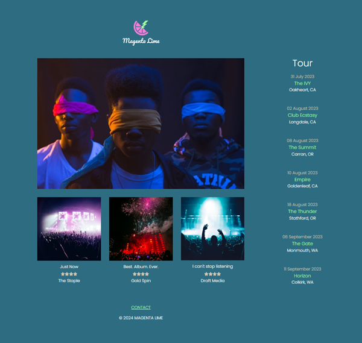

# Magenta Lime Band V1

_This is Version 1_

[Version 2 - under construction](https://github.com/onivardi)

## Table of contents

- [Overview](#overview)
  - [Screenshot](#screenshot)
  - [Links](#links)
- [My process](#my-process)
  - [Built with](#built-with)
  - [Continued development](#continued-development)
  - [Useful resources](#useful-resources)
- [Author](#author)

## Overview

A Webpage for a fictional band.

### Screenshot

## My process

### Built with

- Semantic HTML5 markup
- CSS custom properties
- Grid
- Mobile-first workflow
- [Tailwin CSS](https://tailwindcss.com/) - CSS framework

### Useful resources

- [Tailwind Docs](https://tailwindcss.com/docs/installation)

## Author

- GitHub - [Valdeir Rodrigues](https://github.com/onivardi)
- Twitter - [@VardiRdg](https://twitter.com/VardiRdg)
